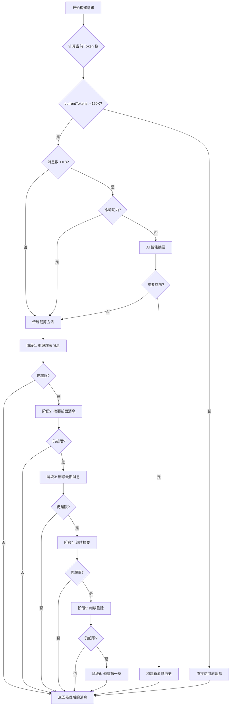

# Kiro2Api 上下文压缩机制分析

> 生成时间：2026-01-15  
> 分析范围：上下文管理、消息压缩、Token 优化

---

## 📋 目录

- [概述](#概述)
- [触发时机](#触发时机)
- [压缩方法](#压缩方法)
- [核心配置](#核心配置)
- [流程图](#流程图)
- [代码位置](#代码位置)
- [优化建议](#优化建议)

---

## 概述

Kiro2Api 实现了一套完整的上下文压缩机制，用于处理 Claude API 的 Token 限制问题。该机制参考了官方 Kiro 客户端的实现，采用**多阶段渐进式压缩策略**，优先保留最近的对话内容和关键信息。

### 核心目标

1. **防止超限错误** - 避免 `CONTENT_LENGTH_EXCEEDS_THRESHOLD` 错误
2. **保留关键信息** - 优先保留最近消息和工具调用结构
3. **智能摘要** - 使用 AI 生成结构化摘要，而非简单截断
4. **性能优化** - 减少不必要的 Token 消耗

---

## 触发时机

### 1. 自动触发条件

**位置**: [`src/kiro/adapter.js`](../../src/kiro/adapter.js) 第 1165-1201 行

```javascript
// 核心配置
const KIRO_CONSTANTS = {
    MAX_CONTEXT_TOKENS: 200000,       // 200K tokens（AWS 限制 ~223K，留缓冲）
    AUTO_SUMMARIZE_THRESHOLD: 0.80,   // 80% = 160K 时开始 pruning
    CONTEXT_FILE_LIMIT: 0.75,         // 上下文文件限制为 75% 窗口
    MIN_MESSAGES_TO_KEEP: 5,          // 摘要时保留最近的消息数量
};
```

**触发逻辑**:

```javascript
const contextLength = KIRO_CONSTANTS.MAX_CONTEXT_TOKENS;  // 200000
const autoSummarizeThreshold = Math.floor(contextLength * KIRO_CONSTANTS.AUTO_SUMMARIZE_THRESHOLD);
// autoSummarizeThreshold = 160000 tokens

// 计算当前 Token 数
let currentTokens = messages.reduce((acc, message) => {
    return acc + this.getFullMessageTokens(message, true);
}, 0);

// 添加系统提示词和工具定义的 Token 数
if (systemPrompt) {
    currentTokens += countTextTokens(systemPrompt, true);
}
if (tools && Array.isArray(tools)) {
    currentTokens += toolsTokens;
}

// 触发条件：当前 Token 数 > 160K
if (currentTokens > autoSummarizeThreshold) {
    // 触发压缩
    messages = await this.pruneChatHistoryWithAI(messages, contextLength, reservedTokens);
}
```

### 2. 触发阈值

| 阈值 | 值 | 说明 |
|------|-----|------|
| **最大上下文** | 200,000 tokens | AWS 实际限制约 223K，留缓冲 |
| **自动摘要阈值** | 80% = 160,000 tokens | 达到此值时触发压缩 |
| **上下文文件限制** | 75% = 150,000 tokens | 单个文件内容限制 |

### 3. 冷却机制

**位置**: [`src/kiro/summarization.js`](../../src/kiro/summarization.js) 第 336 行

```javascript
SUMMARIZATION_COOLDOWN_MS: 3 * 60 * 1000,  // 摘要冷却时间 3 分钟
```

避免频繁触发 AI 摘要，在冷却期内降级到传统裁剪方法。

---

## 压缩方法

### 方法一：AI 智能摘要（优先）

**位置**: [`src/kiro/adapter.js`](../../src/kiro/adapter.js) 第 716-827 行

#### 触发条件

```javascript
const minMessagesForSummary = SUMMARIZATION_CONFIG.MIN_MESSAGES_FOR_SUMMARY || 8;

// 至少 8 条消息才触发 AI 摘要
if (messages.length < minMessagesForSummary) {
    return this.pruneChatHistory(messages, contextLength, reservedTokens);  // 降级
}
```

#### 摘要流程

1. **分离消息**：将消息分为「需要摘要的」和「保留的最近消息」

```javascript
const minKeep = SUMMARIZATION_CONFIG.MIN_MESSAGES_TO_KEEP || 5;
const messagesToSummarize = messages.slice(0, -minKeep);  // 前面的消息
const recentMessages = messages.slice(-minKeep);          // 最近 5 条
```

2. **提取对话信息**：使用 `_extractConversationInfo()` 提取关键内容

```javascript
const extractedInfo = this._extractConversationInfo(messagesToSummarize);
```

3. **构建摘要请求**：使用结构化的摘要指令

```javascript
const summaryPrompt = `[SYSTEM NOTE: Context limit reached. Create a structured summary.]

You are preparing a summary for a new agent instance who will pick up this conversation.

Organize the summary by TASKS/REQUESTS. For each distinct task:
- **SHORT DESCRIPTION**: Brief description of the task
- **STATUS**: done | in-progress | not-started | abandoned
- **DETAILS**: Key context, decisions made, current state
- **NEXT STEPS**: If in-progress, list remaining work
- **FILEPATHS**: Related files (use \`code\` formatting)

CONVERSATION DATA TO SUMMARIZE:
${conversationData}`;
```

4. **流式请求摘要**：使用 `streamApiReal()` 复用现有连接

```javascript
for await (const event of streamApiReal(this, '', summaryModel, summaryRequestBody)) {
    if (event.type === 'content' && event.content) {
        chunks.push(event.content);
    }
}
const summary = chunks.join('');
```

5. **构建新消息历史**：使用 `buildMessagesWithSummary()` 格式化

```javascript
const newMessages = buildMessagesWithSummary(summary, recentMessages, originalCount);
```

#### 摘要输出格式

**位置**: [`src/kiro/summarization.js`](../../src/kiro/summarization.js) 第 13-62 行

```markdown
## TASK 1: Implement user authentication
- **STATUS**: done
- **USER QUERIES**: "Add login endpoint", "Hash passwords"
- **DETAILS**: Completed login endpoint with bcrypt hashing. Tested with 'npm test auth'.
- **FILEPATHS**: `src/auth/login.ts`, `src/models/user.ts`

## TASK 2: Add error handling
- **STATUS**: in-progress
- **USER QUERIES**: "Add validation middleware"
- **DETAILS**: Created basic structure but still need error response formatting.
- **NEXT STEPS**:
  * Add error response formatting in `src/middleware/validation.ts`
  * Integrate middleware with routes in `src/routes/index.ts`
- **FILEPATHS**: `src/middleware/validation.ts`, `src/routes/index.ts`

## USER CORRECTIONS AND INSTRUCTIONS:
- Use bcrypt for password hashing
- Run 'npm test auth' to test, not full suite
```

#### 上下文传递格式

```javascript
const summaryMessage = {
    role: 'user',
    content: `CONTEXT TRANSFER: We are continuing a conversation that had gotten too long. Here is a summary:

---
${summary}
---

METADATA:
The previous conversation had ${originalMessageCount} messages.

INSTRUCTIONS:
Continue working until the user query has been fully addressed. Do not ask for clarification - proceed with the work based on the context provided.
IMPORTANT: If the summary mentions files to read, you should read those files first to restore context.`
};
```

---

### 方法二：传统裁剪（降级方案）

**位置**: [`src/kiro/adapter.js`](../../src/kiro/adapter.js) 第 886-1064 行

当 AI 摘要失败或消息数量不足时，使用多阶段传统裁剪策略。

#### 阶段 1：处理超长消息

```javascript
// 找出超过 contextLength/3 的消息
const longerThanOneThird = longestMessages.filter(message => {
    return this.getFullMessageTokens(message, true) > contextLength / 3;
});

// 对于包含 tool_result 的消息，截断内容
for (const part of message.content) {
    if (part.type === 'tool_result') {
        if (typeof part.content === 'string' && part.content.length > 500) {
            part.content = part.content.substring(0, 500) + '\n[... content truncated for context limit ...]';
        }
    }
}

// 对于纯文本消息，从顶部修剪（保留最新内容）
const prunedText = content.substring(content.length - estimatedChars);
```

#### 阶段 2：摘要前面的消息（保留最后 5 条）

```javascript
let i = 0;
while (totalTokens > contextLength && i < chatHistory.length - 5) {
    const message = chatHistory[i];
    const summarized = this.summarizeMessage(message);
    message.content = summarized;
    i++;
}
```

#### 阶段 3：删除最旧的消息（保留至少 5 条）

```javascript
while (chatHistory.length > 5 && totalTokens > contextLength) {
    const message = chatHistory.shift();
    totalTokens -= this.getFullMessageTokens(message, true);
}
```

#### 阶段 4：继续摘要剩余消息（除了最后一条）

```javascript
i = 0;
while (totalTokens > contextLength && chatHistory.length > 0 && i < chatHistory.length - 1) {
    const message = chatHistory[i];
    // 如果已经是摘要，跳过
    if (content.endsWith('...') && content.length <= 103) {
        i++;
        continue;
    }
    const summarized = this.summarizeMessage(message);
    message.content = summarized;
    i++;
}
```

#### 阶段 5：继续删除旧消息（保留至少 1 条）

```javascript
while (totalTokens > contextLength && chatHistory.length > 1) {
    const message = chatHistory.shift();
    totalTokens -= this.getFullMessageTokens(message, true);
}
```

#### 阶段 6：最终修剪第一条消息

```javascript
if (totalTokens > contextLength && chatHistory.length > 0) {
    const message = chatHistory[0];
    // 截断 tool_result 内容
    if (Array.isArray(message.content)) {
        for (const part of message.content) {
            if (part.type === 'tool_result') {
                part.content = '[... content truncated ...]';
            }
        }
    }
    // 从顶部修剪文本
    const prunedText = content.substring(content.length - estimatedChars);
    message.content = prunedText;
}
```

---

### 方法三：单条消息摘要

**位置**: [`src/kiro/adapter.js`](../../src/kiro/adapter.js) 第 639-703 行

用于阶段 2 和阶段 4 中的单条消息摘要。

```javascript
summarizeMessage(message) {
    const content = message.content;
    const TEXT_TRUNCATE_LENGTH = 1000;        // 普通文本：1000 字符
    const TOOL_RESULT_TRUNCATE_LENGTH = 2000; // 工具结果：2000 字符

    if (Array.isArray(content)) {
        const summarizedContent = [];
        
        for (const part of content) {
            if (part.type === 'text' && part.text) {
                // 截断文本内容
                const truncated = part.text.length > TEXT_TRUNCATE_LENGTH
                    ? part.text.substring(0, TEXT_TRUNCATE_LENGTH) + '...'
                    : part.text;
                summarizedContent.push({ type: 'text', text: truncated });
            } else if (part.type === 'tool_result') {
                // 保留 tool_result 结构，但截断内容
                const truncatedResult = {
                    type: 'tool_result',
                    tool_use_id: part.tool_use_id
                };
                if (part.content) {
                    truncatedResult.content = part.content.length > TOOL_RESULT_TRUNCATE_LENGTH
                        ? part.content.substring(0, TOOL_RESULT_TRUNCATE_LENGTH) + '...[truncated]'
                        : part.content;
                }
                summarizedContent.push(truncatedResult);
            } else if (part.type === 'tool_use') {
                // 保留 tool_use 结构完整
                summarizedContent.push({
                    type: 'tool_use',
                    id: part.id,
                    name: part.name,
                    input: part.input
                });
            }
        }
        
        return summarizedContent;
    }

    // 字符串格式，直接截断
    return content.length > TEXT_TRUNCATE_LENGTH
        ? content.substring(0, TEXT_TRUNCATE_LENGTH) + '...'
        : content;
}
```

---

## 核心配置

### KIRO_CONSTANTS

**位置**: [`src/kiro/adapter.js`](../../src/kiro/adapter.js) 第 64-77 行

```javascript
const KIRO_CONSTANTS = {
    // 上下文窗口管理配置
    MAX_CONTEXT_TOKENS: 200000,       // 200K（AWS 限制 ~223K，留缓冲）
    AUTO_SUMMARIZE_THRESHOLD: 0.80,   // 80% = 160K 时开始 pruning
    CONTEXT_FILE_LIMIT: 0.75,         // 上下文文件限制为 75% 窗口
    MIN_MESSAGES_TO_KEEP: 5,          // 摘要时保留最近的消息数量
    SUMMARIZATION_MODEL: 'claude-sonnet-4-5-20250929',  // 用于生成摘要的模型

    // 工具输出限制
    MAX_TOOL_OUTPUT_LENGTH: 64000,    // 64K 字符，和官方 Kiro 一致
};
```

### SUMMARIZATION_CONFIG

**位置**: [`src/kiro/summarization.js`](../../src/kiro/summarization.js) 第 331-338 行

```javascript
export const SUMMARIZATION_CONFIG = {
    MIN_MESSAGES_TO_KEEP: 5,           // 摘要时保留最近的消息数量
    SUMMARIZATION_MODEL: 'claude-sonnet-4-5-20250929',  // 用于生成摘要的模型
    SUMMARIZE_THRESHOLD_PERCENT: 70,   // 达到 70% 时触发摘要
    MIN_MESSAGES_FOR_SUMMARY: 8,       // 至少 8 条消息才触发 AI 摘要
    SUMMARIZATION_COOLDOWN_MS: 3 * 60 * 1000,  // 摘要冷却时间 3 分钟
    MAX_EXTRACTED_INFO_LENGTH: 50000,  // 提取信息的最大长度
};
```

---

## 流程图



---

## 代码位置

### 核心文件

| 文件 | 功能 | 关键方法 |
|------|------|---------|
| [`src/kiro/adapter.js`](../../src/kiro/adapter.js) | 主适配器 | `buildCodewhispererRequest()`, `pruneChatHistoryWithAI()`, `pruneChatHistory()`, `summarizeMessage()`, `getFullMessageTokens()` |
| [`src/kiro/summarization.js`](../../src/kiro/summarization.js) | 摘要模块 | `generateConversationSummary()`, `buildMessagesWithSummary()`, `extractUsefulInformation()`, `extractUserQueries()` |
| [`src/kiro/api-client.js`](../../src/kiro/api-client.js) | API 客户端 | `countTextTokens()`, `estimateInputTokens()` |
| [`src/kiro/message-sanitizer.js`](../../src/kiro/message-sanitizer.js) | 消息清理 | `sanitizeMessages()`, `getContentText()` |

### 关键方法说明

#### 1. `buildCodewhispererRequest()`

**位置**: 第 1140-1462 行

主入口方法，负责：
- 计算当前 Token 数
- 判断是否需要压缩
- 调用压缩方法
- 构建最终请求

#### 2. `pruneChatHistoryWithAI()`

**位置**: 第 716-827 行

AI 智能摘要方法，负责：
- 检查触发条件
- 分离消息
- 调用流式 API 生成摘要
- 构建新消息历史

#### 3. `pruneChatHistory()`

**位置**: 第 886-1064 行

传统裁剪方法，负责：
- 6 阶段渐进式裁剪
- 保留消息结构
- 精确 Token 控制

#### 4. `summarizeMessage()`

**位置**: 第 639-703 行

单条消息摘要，负责：
- 截断文本内容
- 保留 tool_use/tool_result 结构
- 控制截断长度

#### 5. `getFullMessageTokens()`

**位置**: 第 1071-1130 行

完整 Token 计算，负责：
- 计算文本 Token
- 计算 tool_result 内容
- 计算 tool_use 输入
- 计算 thinking 内容
- 估算图片 Token

---

## 优化建议

### 1. 当前优势

✅ **多阶段渐进式压缩** - 避免一次性丢失过多信息  
✅ **AI 智能摘要** - 保留关键任务和上下文  
✅ **结构保留** - 保持 tool_use/tool_result 的完整性  
✅ **冷却机制** - 避免频繁触发摘要  
✅ **降级策略** - AI 失败时自动降级到传统方法  

### 2. 潜在改进

#### 短期改进

1. **缓存摘要结果**
   - 相同消息历史的摘要可以缓存
   - 减少重复的 AI 调用

2. **增量摘要**
   - 只摘要新增的消息
   - 与之前的摘要合并

3. **优化 Token 计算**
   - 使用更精确的 tokenizer
   - 缓存计算结果

#### 中期改进

1. **智能保留策略**
   - 根据消息重要性决定保留顺序
   - 优先保留包含关键信息的消息

2. **压缩质量评估**
   - 评估摘要的信息保留度
   - 自动调整压缩参数

3. **多级摘要**
   - 对已摘要的内容进行二次摘要
   - 支持更长的对话历史

#### 长期改进

1. **向量化存储**
   - 使用向量数据库存储历史消息
   - 按相关性检索上下文

2. **分布式上下文管理**
   - 支持跨会话的上下文共享
   - 实现上下文的持久化存储

---

## 相关文档

- [技术栈分析](./TECH_STACK_ANALYSIS.md)
- [功能说明文档](../Usage/FUNCTIONAL_GUIDE.md)
- [综合分析报告](./COMPREHENSIVE_ANALYSIS_REPORT.md)

---

**文档维护**: 请在上下文压缩机制发生重大变更时更新本文档  
**最后更新**: 2026-01-15
