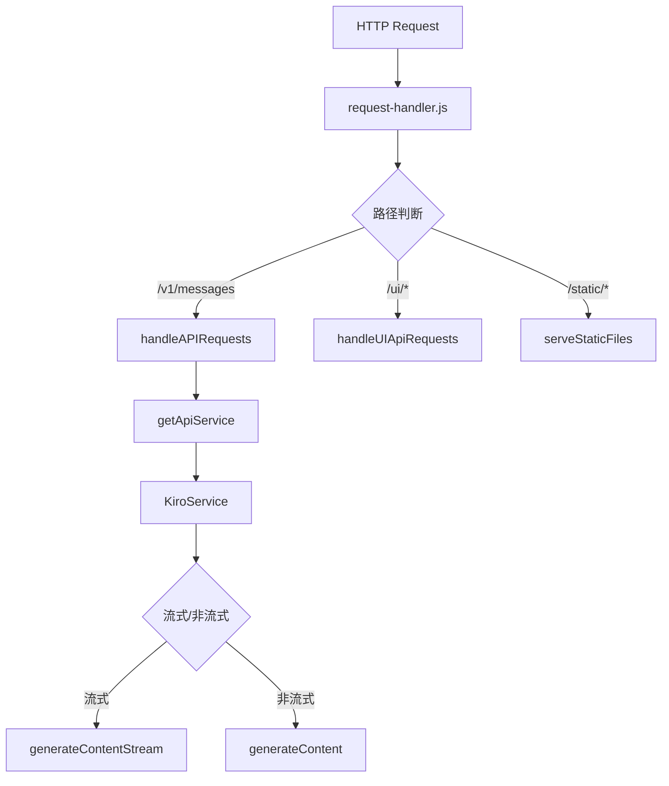
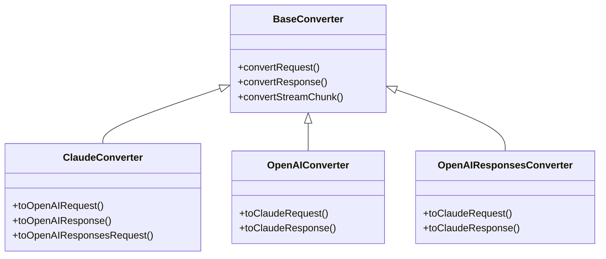

# 系统请求分析与工具调用模式分析报告

## 概述

本报告分析了 kiro2Api 系统中请求信息分析和工具调用的相关操作，识别出相似的处理模式和潜在的优化机会。

## 1. 请求处理流程

### 1.1 请求入口点

系统的请求处理从 [`createRequestHandler()`](src/api/request-handler.js:48) 开始，主要流程如下：



### 1.2 相似的请求处理操作

| 位置 | 操作 | 描述 |
|------|------|------|
| [`request-handler.js:48-192`](src/api/request-handler.js:48) | 请求路由 | 根据路径分发请求 |
| [`api-client.js:120-347`](src/kiro/api-client.js:120) | API 调用 | 发送请求到 AWS CodeWhisperer |
| [`streaming.js:370-660`](src/kiro/streaming.js:370) | 流式 API 调用 | 处理流式响应 |

## 2. 工具调用处理

### 2.1 工具调用的三个阶段

系统中工具调用处理分为三个主要阶段：

#### 阶段 1：工具定义转换（请求前）

在 [`adapter.js:344-468`](src/kiro/adapter.js:344) 的 `convertToQTool()` 方法中，系统将多种工具格式统一转换为 AWS CodeWhisperer 支持的 `toolSpecification` 格式：

- **格式 0**: Kiro 内置工具（直接传递）
- **格式 1**: OpenAI 风格 `{ function: { name, description, parameters } }`
- **格式 2**: Kiro 原生格式（已是 toolSpecification）
- **格式 3**: Anthropic/Claude 格式 `{ name, description, input_schema }`
- **格式 4**: 带 id 和 parameters 格式
- **格式 5**: 带 id 和 schema 格式

#### 阶段 2：工具参数映射（请求时）

在 [`tools.js`](src/kiro/tools.js) 中定义了 Claude Code 到 Kiro 的工具映射：

```javascript
// CC_TO_KIRO_TOOL_MAPPING 示例
{
  Read: { kiroTool: 'Read', paramMap: { file_path: 'path' } },
  Write: { kiroTool: 'Write', paramMap: { file_path: 'path', file_text: 'content' } },
  // ...
}
```

相关函数：
- [`mapToolUseParams()`](src/kiro/tools.js:224) - CC → Kiro 参数映射
- [`reverseMapToolInput()`](src/kiro/tools.js:258) - Kiro → CC 参数反向映射

#### 阶段 3：工具调用解析（响应时）

系统支持两种工具调用格式的解析：

1. **结构化事件流解析** - [`api-client.js:28-108`](src/kiro/api-client.js:28)
   - 解析 SSE 格式的 `toolUse` 事件
   - 累积 `input` 字段直到 `stop` 标志

2. **Bracket 格式解析** - [`tools.js:290-398`](src/kiro/tools.js:290)
   - 解析文本中的 `[Called toolName with args: {...}]` 格式
   - 使用正则表达式提取工具名和参数

### 2.2 相似的工具处理操作

| 位置 | 函数 | 描述 |
|------|------|------|
| [`adapter.js:319-333`](src/kiro/adapter.js:319) | `mapToolUseParams()` | 参数名映射（CC→Kiro） |
| [`adapter.js:331-333`](src/kiro/adapter.js:331) | `reverseMapToolInput()` | 参数名反向映射（Kiro→CC） |
| [`tools.js:290-334`](src/kiro/tools.js:290) | `parseSingleToolCall()` | 解析单个 bracket 格式工具调用 |
| [`tools.js:378-398`](src/kiro/tools.js:378) | `parseBracketToolCalls()` | 解析所有 bracket 格式工具调用 |
| [`tools.js:deduplicateToolCalls`](src/kiro/tools.js) | `deduplicateToolCalls()` | 工具调用去重 |

## 3. 协议转换器中的相似操作

### 3.1 转换器架构

系统使用策略模式实现多协议支持：



### 3.2 工具调用转换的相似模式

在各转换器中，工具调用的处理模式高度相似：

| 转换器 | 工具调用处理位置 | 描述 |
|--------|------------------|------|
| [`ClaudeConverter.js:140-204`](src/converters/strategies/ClaudeConverter.js:140) | `toOpenAIRequest()` | Claude tool_use → OpenAI tool_calls |
| [`ClaudeConverter.js:312-337`](src/converters/strategies/ClaudeConverter.js:312) | `toOpenAIResponse()` | 响应中的工具调用转换 |
| [`ClaudeConverter.js:417-519`](src/converters/strategies/ClaudeConverter.js:417) | `toOpenAIStreamChunk()` | 流式工具调用转换 |
| [`OpenAIConverter.js:148-157`](src/converters/strategies/OpenAIConverter.js:148) | `toClaudeRequest()` | OpenAI tool → Claude tool_result |
| [`OpenAIConverter.js:297-300`](src/converters/strategies/OpenAIConverter.js:297) | `toClaudeResponse()` | 响应中的工具调用转换 |

## 4. 识别的相似操作和优化机会

### 4.1 重复的工具调用解析逻辑

**问题**: 工具调用解析在多处重复实现

- [`api-client.js:28-108`](src/kiro/api-client.js:28) - `parseEventStreamChunk()`
- [`streaming.js:266-293`](src/kiro/streaming.js:266) - 事件流解析
- [`api-client.js:711-763`](src/kiro/api-client.js:711) - `generateContentStream()` 中的工具处理

**建议**: 提取统一的工具调用解析器

### 4.2 重复的参数映射逻辑

**问题**: 参数映射在 adapter.js 和 tools.js 中都有实现

- [`adapter.js:319-333`](src/kiro/adapter.js:319) - 包装方法
- [`tools.js:224-270`](src/kiro/tools.js:224) - 实际实现

**建议**: 统一到 tools.js，adapter.js 只做调用

### 4.3 重复的工具格式转换

**问题**: 工具格式转换在多处实现

- [`adapter.js:344-468`](src/kiro/adapter.js:344) - `convertToQTool()`
- [`adapter.js:475-550`](src/kiro/adapter.js:475) - `convertToQToolWithMapping()`
- 各 Converter 中的工具转换

**建议**: 创建统一的 ToolConverter 类

### 4.4 重复的 Token 计算

**问题**: Token 计算在多处实现

- [`api-client.js:1034-1052`](src/kiro/api-client.js:1034) - `countTextTokens()`
- [`adapter.js:1090-1149`](src/kiro/adapter.js:1090) - `getFullMessageTokens()`

**建议**: 统一 Token 计算逻辑到单独模块

## 5. 建议的重构方案

### 5.1 创建统一的工具处理模块

```javascript
// src/kiro/tool-processor.js
export class ToolProcessor {
  // 工具定义转换
  static convertToolDefinition(tool, format) { ... }

  // 参数映射
  static mapParameters(toolName, params, direction) { ... }

  // 工具调用解析
  static parseToolCall(data, format) { ... }

  // 工具调用去重
  static deduplicateToolCalls(calls) { ... }
}
```

### 5.2 创建统一的请求分析模块

```javascript
// src/kiro/request-analyzer.js
export class RequestAnalyzer {
  // 分析请求类型
  static analyzeRequestType(request) { ... }

  // 提取工具调用
  static extractToolCalls(response) { ... }

  // 计算 Token
  static calculateTokens(content) { ... }
}
```

### 5.3 重构优先级

| 优先级 | 重构项 | 影响范围 | 复杂度 |
|--------|--------|----------|--------|
| 高 | 统一工具调用解析 | api-client, streaming | 中 |
| 高 | 统一参数映射 | adapter, tools | 低 |
| 中 | 统一工具格式转换 | adapter, converters | 高 |
| 中 | 统一 Token 计算 | api-client, adapter | 低 |
| 低 | 创建 ToolProcessor 类 | 全局 | 高 |

## 6. 总结

系统中存在以下主要的相似操作：

1. **工具调用解析** - 在 api-client.js、streaming.js、tools.js 中有重复实现
2. **参数映射** - 在 adapter.js 和 tools.js 中有重复逻辑
3. **工具格式转换** - 在 adapter.js 和各 Converter 中有相似实现
4. **Token 计算** - 在 api-client.js 和 adapter.js 中有重复实现

建议按优先级逐步重构，首先统一工具调用解析和参数映射逻辑，然后再考虑更大范围的重构。
